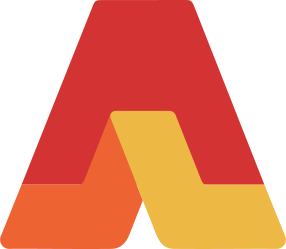

<p align="center">
	
</p>

<h1 align="center">AdLad</h1>

AdLad allows you to easily integrate ads for your games without the need for different implementations from every
publisher. Instead, you can configure which plugins you would like to use, and whenever you want to show an ad, AdLad
will forward your request to the plugin that is currently active.

## List of available plugins

- [adlad-plugin-dummy](https://github.com/Pelican-Party/adlad-plugin-dummy) for test ads during development.
- [adlad-plugin-crazygames](https://github.com/Pelican-Party/adlad-plugin-crazygames) for
  [crazygames.com](https://www.crazygames.com/)
- [adlad-plugin-poki](https://github.com/Pelican-Party/adlad-plugin-poki) for [poki.com](https://poki.com/)
- [adlad-plugin-gamedistribution](https://github.com/Pelican-Party/adlad-plugin-gamedistribution) for
  [gamedistribution.com](https://gamedistribution.com/sdk/html5)
- [adlad-plugin-gamemonetize](https://github.com/Pelican-Party/adlad-plugin-gamemonetize) for
  [gamemonetize.com](https://gamemonetize.com/)
- [adlad-plugin-gamepix](https://github.com/Pelican-Party/adlad-plugin-gamepix) for
  [gamepix.com](https://www.gamepix.com/)
- [adlad-plugin-google-ad-placement](https://github.com/Pelican-Party/adlad-plugin-google-ad-placement) for the
  [AdSense Ad Placement API](https://developers.google.com/ad-placement/apis)
- [adlad-plugin-coolmathgames](https://github.com/Pelican-Party/adlad-plugin-coolmathgames) for
  [coolmathgames.com](https://www.coolmathgames.com/)
- [adlad-plugin-wgplayer](https://github.com/Pelican-Party/adlad-plugin-wgplayer) for
  [wgplayground.com](https://wgplayground.com)

## Usage

To quickly get started, you can use jsdelivr.com to import AdLad:

```html
<script type="module">
	import {AdLad} from "https://cdn.jsdelivr.net/npm/@adlad/adlad/mod.min.js";

	// You need at least one plugin in order for AdLad calls to function.
	import {crazyGamesPlugin} from "https://cdn.jsdelivr.net/npm/@adlad/plugin-crazygames/mod.min.js";

	const adLad = new AdLad({
		plugins: [
			crazyGamesPlugin(),
		]
	});
</script>
```

You can immediately start making calls, but ads won't show until the plugin has initialized.

```js
await adLad.showFullScreenAd();
```

Both `showFullScreenAd()` and `showRewardedAd()` return an object that allows you to determine if an ad was shown.

```js
const result = await adLad.showRewardedAd();
console.log(result); // { didShowAd: true, errorReason: null }
```

Some portals require you to report loading and gameplay state, which can be done with the methods below. You can call
these as often as you like, if you call `gameplayStart()` twice in a row for example, AdLad will make sure it is passed
to the plugin only once.

```js
adLad.gameplayStart();
adLad.gameplayStop();
adLad.loadStart();
adLad.loadStop();
```

It's important that you mute audio and pause gameplay during ads. This can be done by observing the following values:

```js
adLad.needsPause; // true | false
adLad.needsMute; // true | false
```

Usually these both become `true` once you make a call for showing ads, but plugins can manually override this value.
That way your game always behaves according to the policies of the platform it's embedded on.

You can also listen for changes to these values:

```js
adLad.onNeedsPauseChange((needsPause) => {
	console.log(needsPause);
});
adLad.onNeedsMuteChange((needsMute) => {
	console.log(needsMute);
});
```

You can use `adLad.removeOnNeedsPauseChange` and `adLad.removeOnNeedsMuteChange` To remove your callbacks.

Once you have experimented enough, you can bundle AdLad using a build tool of choice. AdLad is available as
[an npm package](https://www.npmjs.com/package/@adlad/adlad) and on [deno.land/x](https://deno.land/x/adlad@v0.1.0).

For the full API reference, see
[this page](https://doc.deno.land/https://cdn.jsdelivr.net/npm/@adlad/adlad/dist/AdLad.d.ts).

## Plugins

By default the first available plugin from your `plugins` option is used. You can get the id of the active plugin using
`adLad.activePlugin`.

To override which plugin is active, you can pass the plugin id via the `plugin` option like so:

```js
const adLad = new AdLad({
	plugins: [notSoCoolPlugin(), myCoolPlugin()],
	plugin: "my-cool-plugin",
});
```

Alternatively, you can use the `?adlad=my-cool-plugin` query string. This is useful when you want to host your own page,
while still allowing gaming portals to use a specific plugin. You can simply provide each gaming portal with a different
url.

## Tree shaking unused plugins

If you make separate builds for each publisher, you can conditionally include plugins based on build flags. That way,
unnecessary code is excluded from your build.

Ultimately, the best way to do this depends on your build pipeline. But let's assume you use something like
[Rollup](https://rollupjs.org/) and [`@rollup/plugin-replace`](https://www.npmjs.com/package/@rollup/plugin-replace).

In your build script you can configure the rollup plugin like so:

```js
replace({
	values: {
		DEBUG_BUILD: String(debug),
		PUBLISHER_BUILD: `'${publisher}'`,
	},
	preventAssignment: true,
});
```

Where `debug` and `publisher` are variables in your script set by a commandline flag for instance.

Then in your client code you can do something like this:

```js
// Use a local import path which points to your node_modules,
// or use an import map if necessary.
import { AdLad } from "https://cdn.jsdelivr.net/npm/@adlad/adlad/mod.min.js";
import { dummyPlugin } from "https://cdn.jsdelivr.net/npm/@adlad/plugin-dummy/mod.js";
import { somePublisherPlugin } from "./path/to/publisher/plugin.js";

// Declare the same global variables.
// This is only required if you want to be able to run this script without a build step.
globalThis.DEBUG_BUILD = true;
globalThis.PUBLISHER_BUILD = "none";

let plugins = [];
let plugin = "none";

if (DEBUG_BUILD) {
	plugins.push(dummyPlugin());
	plugin = "dummy";
}

if (PUBLISHER_BUILD == "somepublisher") {
	plugins.push(somePublisherPlugin());
	plugin = "some-publisher";
}

const adLad = new AdLad({
	plugins,
	plugin,
});

console.log(adLad.activePlugin); // Should print "dummy" or "some-publisher" based on your build flags.
```

Now if your build pipeline is configured correctly, it will tree shake these plugins depending on the configured
`DEBUG_BUILD` and `PUBLISHER_BUILD` values.
